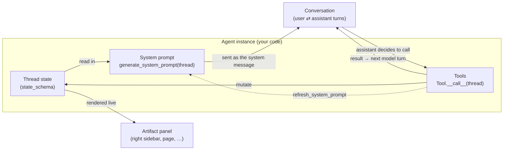

# Agent Developer Guide

This portal runs on a **general-purpose chat engine**. The engine knows how to
stream a conversation, call tools in a loop, persist history, and push render
data to the browser — and it knows _nothing_ about weather, legal triage, or
any specific behavior.

Everything domain-specific lives in an **agent**: a small bundle of config,
a state schema, a system-prompt function, and some tools (plus, optionally, the
frontend templates those tools render with). You build new behavior by
**configuring these ingredients**, not by editing the engine.

> **The division of labor:** the engine is the stage and the lighting rig; an
> agent is the script and the cast. You can write an entirely new play — new
> agent, new tools, new on-screen components — without ever touching the stage.

| The engine owns (don't touch)                | An agent author provides                |
| -------------------------------------------- | --------------------------------------- |
| The streaming loop & tool-calling loop       | `completion_args` (the LLM config)      |
| Persisting messages & projecting history     | `state_schema` (a Pydantic model)       |
| SSE events (`content_delta`, `tool_call`, …) | `generate_system_prompt(thread_id)`     |
| Rendering tool templates → HTML              | `tools = [...]` (Tool subclasses)       |
| Reloading a thread for the frontend          | tool templates under `templates/tools/` |

Engine code: [`services/chat_v2.py`](../litigant_portal/app/services/chat_v2.py) ·
Abstraction: [`agents_v2/base.py`](../litigant_portal/agents_v2/base.py) ·
Demo agent: [`agents_v2/weather.py`](../litigant_portal/agents_v2/weather.py) ·
Tools: [`agents_v2/tools/`](../litigant_portal/agents_v2/tools/)

---

## How the pieces flow



Read it as a loop:

1. **State feeds the system prompt.** `generate_system_prompt` reads the
   thread's state (and the user, and the conversation — all reachable from the
   thread) and produces the instructions the model sees.
2. **The system prompt frames the conversation.** It is prepended on every
   request and steers the back-and-forth with the user.
3. **The conversation produces tool calls.** When the model decides to act, the
   engine runs the matching tool.
4. **Tools feed back into state** (and return a result to the model, and render
   data to the browser). The next turn's system prompt sees the updated state —
   immediately, if the tool asks for it via `refresh_system_prompt`.
5. **State is rendered elsewhere too.** Because state is just JSON on the thread,
   the frontend can show it anywhere — e.g. the right-hand artifact sidebar.

---

## Anatomy of an agent

An agent is a configuration object. It binds together five ingredients. The
[`Agent`](../litigant_portal/agents_v2/base.py) base class is deliberately tiny —
it holds config and a prompt method, and that's it. **Streaming and tool
execution are the engine's job, not the agent's.**

### 1. The LLM config — `completion_args`

A plain dict of litellm completion kwargs for tuning the call — `temperature`,
`max_tokens`, `reasoning_effort`, and so on.

```python
completion_args = {"max_tokens": 1000}
```

These are spread into `litellm.completion(...)`. **Don't put `model` here** — you'll get an error if you try.
The model is supplied to the engine by the endpoint (eventually from a site
config model), not the agent, and setting it in `completion_args` raises.

### 2. The state — `state_schema`

State is an **arbitrary object you define** with a Pydantic model. It is stored
as JSON on `ChatThread.state` and is the agent's memory across turns: recently
checked locations, a partially-filled intake form, a draft document, flags —
whatever your agent needs.

```python
class WeatherState(AgentState):
    recent_locations: list[str] = []
```

`AgentState` is just a `BaseModel` with `extra="allow"`. Validate the thread's
raw JSON into it with `WeatherState.model_validate(thread.state or {})`, mutate,
then `thread.state = state.model_dump()` and save.

### 3. The system prompt — `generate_system_prompt(thread_id)`

A method that builds the system prompt **on the fly** from a thread. It is given
the `thread_id`, loads the thread, and from there it can reach:

- **state** — `thread.state` (the agent's memory),
- **the user** — `thread.identity` (and anything attached to it),
- **the conversation** — `thread.messages`.

```python
def generate_system_prompt(self, *, thread_id) -> str:
    thread = ChatThread.objects.get(id=thread_id)
    state = WeatherState.model_validate(thread.state or {})
    ...
    return "You are a friendly weather assistant.\n..."
```

> The system prompt is **never stored** in message history. It is regenerated
> for every request (and again mid-turn whenever a tool sets
> `refresh_system_prompt=True`). This is what lets state changes show up in the
> model's instructions instantly.

### 4. The tools — `tools = [...]`

Tools live **one per file** in the nested `agents_v2/tools/` module; an agent
imports the ones it needs into its `tools` list. A tool is a Pydantic model
whose fields _are_ the input schema; it implements `__call__(thread_id)` and
returns a `ToolOutput`. Like the prompt generator, a tool gets the thread, so it
can **read and manipulate state**.

```python
class CheckWeather(Tool):
    """Check the current weather for a location."""
    location: str = Field(description="City or place to check the weather for")

    def __call__(self, *, thread_id) -> ToolOutput:
        ...  # load thread, mutate state, return ToolOutput
```

The engine auto-generates the function schema from the model (`get_schema()`),
dispatches calls by class name, and runs the loop. You never write loop code.

#### The `ToolOutput` contract

Every tool returns a `ToolOutput` with three ingredients:

| Field                   | Goes to      | Purpose                                                                         |
| ----------------------- | ------------ | ------------------------------------------------------------------------------- |
| `result`                | the model    | The tool's answer, fed back as the tool message content.                        |
| `render_data`           | the frontend | Arbitrary JSON streamed for rendering (and persisted).                          |
| `refresh_system_prompt` | the engine   | If `True`, regenerate the system prompt before the next step (default `False`). |

```python
return ToolOutput(
    result=f"It is 72 degrees in {self.location}.",
    render_data={"location": self.location, "temp_f": 72},
    refresh_system_prompt=True,
)
```

### 5. Tool rendering — default box, custom template, or nothing

Every tool call and every tool result is rendered in the conversation. You
control how with two class attributes, `tool_call_template` and
`tool_result_template`:

| Value                        | Behavior                                                                |
| ---------------------------- | ----------------------------------------------------------------------- |
| `None` _(default)_           | The engine renders a **slick JSON box** of the call args / result data. |
| `False`                      | Render **nothing**.                                                     |
| `"tools/your_template.html"` | Render a **custom Django template** under `templates/tools/`.           |

The call template receives `{ args }` (the tool's inputs); the result template
receives `{ data }` (the tool's `render_data`). The engine renders them to HTML
server-side and ships the HTML in the SSE event, so a custom template is just
ordinary Django + cotton.

> The **call** card is transient — the frontend shows it only while that tool is
> the last thing on screen (perfect for a "working…" spinner). The **result**
> card persists. Default JSON boxes persist for both.

---

## Build an agent end to end: the Weather demo

The weather agent is the canonical hello-world. Here is every file, with each
ingredient called out. To "expand" it into a real agent you grow these same
files — the only _new_ file you ever add is one more tool under `tools/`.

### `litigant_portal/agents_v2/tools/check_weather.py`

One tool per file. INGREDIENT 4 (the tool) and INGREDIENT 5 (how it renders).

```python
"""CheckWeather — a mock weather lookup for the demo weather agent."""

import time

from ..base import Field, Tool, ToolOutput


class CheckWeather(Tool):
    """Check the current weather for a location."""

    location: str = Field(description="City or place to check the weather for")

    # INGREDIENT 5: custom templates (None → JSON box, False → nothing)
    tool_call_template = "tools/check_weather_call.html"
    tool_result_template = "tools/check_weather_result.html"

    def __call__(self, *, thread_id) -> ToolOutput:
        from litigant_portal.app.models import ChatThread

        from ..weather import WeatherState

        time.sleep(2)  # demo-only: keeps the "checking weather" card visible

        # Tools manipulate state by loading the thread and saving it back.
        thread = ChatThread.objects.get(id=thread_id)
        state = WeatherState.model_validate(thread.state or {})
        if self.location not in state.recent_locations:
            state.recent_locations.append(self.location)
            thread.state = state.model_dump()
            thread.save(update_fields=["state", "updated_at"])

        temp_f = 72
        return ToolOutput(
            result=f"It is {temp_f} degrees in {self.location}.",
            render_data={"location": self.location, "temp_f": temp_f},
            refresh_system_prompt=True,  # new location shows up next prompt
        )
```

```python
# litigant_portal/agents_v2/tools/__init__.py — export each tool
from .check_weather import CheckWeather
```

### `litigant_portal/agents_v2/weather.py`

The agent binds the ingredients together and pulls its tools from `.tools`.

```python
"""A hello-world weather agent demonstrating the agents_v2 abstraction."""

from django.utils import timezone

from .base import Agent, AgentState
from .tools import CheckWeather


# ── INGREDIENT 2: state ──────────────────────────────────────────────
class WeatherState(AgentState):
    """What the weather agent remembers across a thread."""

    recent_locations: list[str] = []


# ── The agent: bind the ingredients together ─────────────────────────
class WeatherAgent(Agent):
    """A demo agent that can check the weather."""

    completion_args = {"max_tokens": 1000}       # INGREDIENT 1: LLM config
    state_schema = WeatherState                  # INGREDIENT 2
    tools = [CheckWeather]                        # INGREDIENT 4 (from .tools)

    # INGREDIENT 3: the system prompt, built from the thread (state + user +
    # conversation are all reachable here).
    def generate_system_prompt(self, *, thread_id) -> str:
        from litigant_portal.app.models import ChatThread

        thread = ChatThread.objects.get(id=thread_id)
        state = WeatherState.model_validate(thread.state or {})
        now = timezone.localtime().strftime("%A, %B %-d, %Y at %-I:%M %p")
        recent = ", ".join(state.recent_locations) or "none yet"
        return (
            "You are a friendly weather assistant.\n"
            f"The current date and time is {now}.\n"
            f"Recently checked locations: {recent}.\n"
            "If the user asks about the weather for a location, use the "
            "CheckWeather tool. If they ask about a location you've already "
            "checked recently, you may report it from memory instead."
        )
```

### `litigant_portal/app/templates/tools/check_weather_call.html`

The **call** card — a spinner while the tool is in flight. Context: `args`.

```html
{# CheckWeather call card. Context: `args` (the tool's input fields). #}
<div
  class="inline-flex items-center gap-2 rounded-lg border border-greyscale-200 bg-greyscale-50 px-3 py-2 text-sm text-greyscale-600"
>
  <span class="flex gap-1" aria-hidden="true">
    <span class="typing-dot"></span>
    <span class="typing-dot"></span>
    <span class="typing-dot"></span>
  </span>
  <span>Checking weather in {{ args.location }}…</span>
</div>
```

### `litigant_portal/app/templates/tools/check_weather_result.html`

The **result** card. Context: `data` (the tool's `render_data`).

```html
{# CheckWeather result card. Context: `data` (the tool's render_data). #}
<div
  class="inline-flex items-center gap-2 rounded-lg border border-greyscale-200 bg-white px-3 py-2 text-sm"
>
  <c-atoms.icon name="cloud" class="w-4 h-4 text-greyscale-400" />
  <span class="font-medium text-greyscale-800">{{ data.location }}</span>
  <span class="text-greyscale-500">{{ data.temp_f }}°F</span>
</div>
```

### Registering & wiring it up

Export the agent from the package and hand it to the engine. The
`chat_stream` view picks the agent class; everything downstream is generic.

```python
# litigant_portal/agents_v2/__init__.py
from .tools import CheckWeather
from .weather import WeatherAgent, WeatherState

# litigant_portal/app/views/chat_v2.py  (the only line that names an agent)
return chat_stream_service(
    identity=request.identity, message=message,
    thread_id=thread_id, agent_class=WeatherAgent,
)
```

> Today the view hard-codes `WeatherAgent`. Binding an agent to a thread (so
> different threads can run different agents) is the natural next step — when it
> lands, the view and `message_list` will read the agent class from the thread.

---

## What the engine does with all this (for reference)

You won't edit this, but it helps to know the contract.

- **Per step** it builds `[system prompt] + history`, streams the model's
  content, accumulates any tool calls, persists the assistant message, runs each
  tool, persists each tool result, and repeats until the model stops calling
  tools (bounded by `MAX_STEPS`).
- **It streams SSE events** the frontend already knows how to render:
  `thread`, `content_delta`, `tool_call`, `tool_response`, `state`, `done`,
  `error`. The `tool_call`/`tool_response` events carry a render directive —
  `render_mode` (`default` | `custom` | `skip`) plus `render_html` for custom
  templates — so **new tools render with zero new frontend code**.
- **State is pushed to the browser** via the `state` event after any step that
  ran tools, and returned on reload — which is how the artifact sidebar stays in
  sync.

### One canonical store, two projections

Messages are stored once, as a **superset** of the litellm message (a tool
message keeps a `data` field for `render_data` alongside the API fields). The
engine then derives two views explicitly:

- **`_to_llm_message`** — whitelists only API-valid keys, so frontend-only
  fields can never leak into the completion request.
- **`thread_render_items`** — pairs each assistant tool call with its result by
  `tool_call_id` and re-renders the templates, so a **reloaded** thread looks
  identical to a freshly streamed one.

---

## Conversation history: hidden & compaction messages

Two message capabilities extend the history model without changing how agents
are authored. Both are engine behavior driven by per-message flags — agents and
tools opt in, the engine does the rest.

### Hidden messages

A **hidden message** lives in the history the model sees but is **never returned
to the frontend**. It's the `hidden` boolean on `ChatMessage`, and it's the
practical face of the engine's "one store, two projections" split:

- **LLM view** — `chat_message_list(thread=…)` returns _all_ messages, hidden
  included, and `chat_stream` feeds that to litellm. The model reads a hidden
  message like any other turn.
- **Render view** — `chat_message_list_visible(thread=…)` is just
  `chat_message_list(...).filter(hidden=False)`. Both frontend projections use
  it: `thread_render_items` (thread reload) and the `thread_list` sidebar
  snippet. A hidden message gets no bubble, no card, and never seeds a snippet.

Use it for context the model should have but the user shouldn't see as a chat
turn: injected retrieval results, scaffolding/setup instructions, a note a tool
records for later reasoning, or developer guidance mid-conversation.

**Injecting one** — `chat_message_inject_hidden` (in `services/chat_v2.py`):

```python
from litigant_portal.app.services.chat_v2 import chat_message_inject_hidden

chat_message_inject_hidden(
    thread_id=thread_id,
    content="<retrieved statute text the model should ground on>",
    model=model,
    role="user",  # default; "assistant" / "system" also valid
)
```

It takes the `model` (to count tokens, like every message) and is keyed by
`thread_id`. The message is stored with `hidden=True` and deliberately does
**not** bump the thread's `updated_at` — injecting context never reorders the
sidebar or changes the snippet.

### Compaction messages _(designed; not yet implemented)_

A **compaction message** is an engine-generated summary that lets a thread grow
indefinitely while keeping per-request token cost bounded. It would be flagged
`is_compacted=True`, with content that condenses everything before it.

- When a thread crosses a **token threshold**, the engine would generate a
  summary of the conversation so far and store it as a compaction message.
- On history retrieval **for the model**, it would read **only from the most
  recent compaction message onward** — the summary standing in for all prior
  turns. Older messages stay in the database but cost nothing per request.
- The **frontend would still show the full history** (with a subtle "summarized
  earlier" divider), so the user experiences one continuous, effectively
  infinite chat.

Like hidden messages, this keeps the LLM view lean and intentional while the
render view stays complete — the same "one store, two projections" principle the
engine already uses for tool data and hidden messages.

---

## TL;DR for building a new agent

1. Create `agents_v2/<your_agent>.py`.
2. Define a `state_schema` (subclass `AgentState`).
3. Write `generate_system_prompt(thread_id)` — read state/user/conversation off
   the thread.
4. Write one `Tool` subclass per action, one file each under `agents_v2/tools/`
   (export it from `tools/__init__.py`); return `ToolOutput(result, render_data,
refresh_system_prompt)`; mutate state through the thread.
5. (Optional) Add `templates/tools/*.html` for custom call/result cards — or
   leave the default JSON box.
6. Subclass `Agent`, set `completion_args`, `state_schema`, and `tools` (imported
   from `.tools`); export it and hand it to the engine.

No engine edits. No frontend edits (unless you _want_ custom cards). That's the
point.
