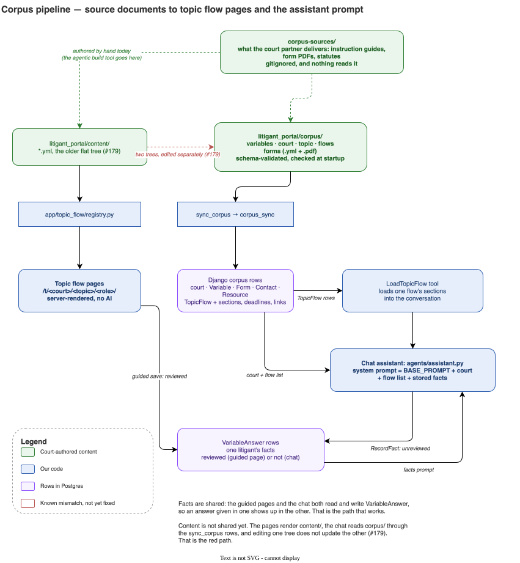

# Corpus pipeline

How source documents become the topic flow pages and the assistant's prompt, and how the
two surfaces share a litigant's facts.

Source: `corpus-pipeline.drawio`. Editing and SVG regeneration follow [README.md](README.md).

## The premise

The non-AI topic flow and the AI assistant should answer from one source of truth.
Improve a flow and both surfaces improve.

That holds today for **facts**: the guided pages and the chat both read and write
`VariableAnswer`, so an answer given in one shows up in the other. It does not hold yet
for **content**: the pages render `content/`, the chat reads `corpus/`, and editing one
tree does not update the other (#179).

## Layer 1: source documents

`corpus-sources/` holds what court partners deliver: instruction guides, form PDFs,
statutes. It is gitignored apart from its README (partner binaries, and the durable
home is the wiki).

Nothing reads it. Source documents become corpus YAML because a person reads them and
writes the YAML. That step is where the agentic build tool goes, and it currently has
no schema on the input side and no coverage check on the output side. An omission is
invisible: North Dakota's instructions give two statutory grounds for waiving
publication, our flow prose carried one, and no check noticed.

## Layer 2: repository trees

| Tree                       | Holds                                                   | Read by                                                     |
| -------------------------- | ------------------------------------------------------- | ----------------------------------------------------------- |
| `litigant_portal/corpus/`  | variables, court, topic, flows, forms (`.yml` + `.pdf`) | `selectors/corpus.py`, then `sync_corpus`                   |
| `litigant_portal/content/` | the older flat corpus                                   | `app/topic_flow/registry.py`                                |
| `litigant_portal/prompts/` | `courts/<court>/prompt.md`, `topics/<topic>/prompt.md`  | nothing reads the text; a file existing gates its deep link |
| `litigant_portal/agents/`  | `BASE_PROMPT` and the court, flow and facts templates   | the chat assistant, assembled per turn                      |

`corpus/` is the contract boundary. It is schema-validated and checked at startup, so
it is the right emit target for a build tool.

`content/` still renders the live public flow pages at `/t/<court>/<topic>/<role>/`.
Which tree retires is open under #179.

`prompts/` is not corpus. Its `prompt.md` files are left from the earlier prompt-backed
chat. The deep-link route (`pages.deep_link`) only checks that a court's and a topic's
file exist.

## Layer 3: build step

One publisher reads `corpus/`: `sync_corpus` → `services/corpus.py` writes the Django
rows. That is the site's court config, the `Variable` glossary, `Form` and its fields,
`Contact` and `Resource`, and each `TopicFlow` with its sections, interview pages, form
conditions, deadlines and links.

## Layer 4: run time

**Guided pages.** The topic flow page renders `content/` through the registry. Saving a
section writes the litigant's answers as `VariableAnswer` rows marked `reviewed`: this
page is where a person confirms a fact.

**Chat.** The assistant (`agents/assistant.py`) builds its system prompt each turn from
four parts: `BASE_PROMPT`, the court (from the site's config), the list of available
flows (from the `TopicFlow` rows), and the litigant's stored facts (from
`VariableAnswer`, each marked confirmed or unconfirmed). When a conversation matches a
situation, the `LoadTopicFlow` tool loads that flow's sections into the conversation,
and the flow stays active for the thread. The `RecordFact` tool writes facts the
litigant states in chat as `VariableAnswer` rows marked unreviewed (#947).

**docassemble prefill** sends only reviewed answers, so a fact the chat recorded
reaches a court form only after a person confirms it.

`/dev/agent` runs the separate `lp_agent` harness. It is a development tool and not part
of the chat path above.

## Known gaps

- No contract or tooling between source documents and `corpus/`, and no coverage check.
- No statute text in `corpus-sources/`, and no decision-tree document. The decision tree
  exists only as the split between flow files.
- Two live corpus trees, edited separately (#179).
- Chat answers don't cite the corpus yet (#949).
- Facts the chat records can't be confirmed from the chat yet, so they never reach the
  docassemble prefill (#948).
- The stored-facts prompt lists every answer in every conversation, whatever the topic
  (#962).
- No fallback to the guided flow when the AI is unavailable (#950).
- `docs/wiki/ai-tone-guide.md` is the cross-court tone guide in prose. It is not wired
  into any prompt layer.
