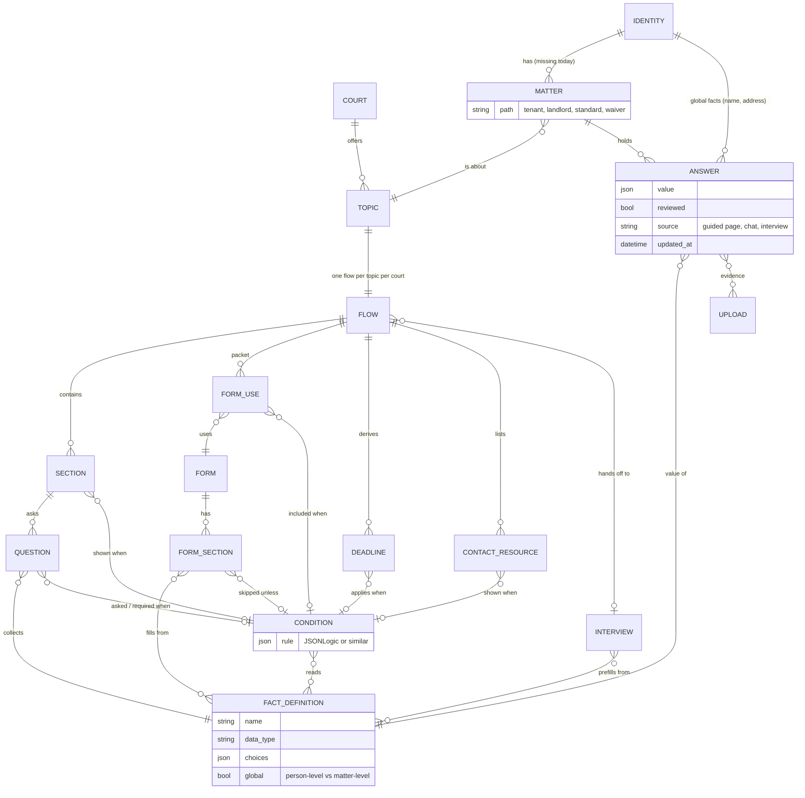

# Rules model (proposed, #970)

**A sketch of where topic flows are going, not what runs today.** Of the entities below, `MATTER`, `CONDITION`, `FORM_SECTION` and `ANSWER.source` do not exist on main yet; the rest do, under their current model names (`Variable` for `FACT_DEFINITION`, `VariableAnswer` for `ANSWER`).

A topic flow becomes a rules model: facts are the state, and every thing that might or might not appear (a section, a question, a form, a deadline) declares when it applies. The rule sits on the gated thing and reads the facts; answers carry no logic of their own.

## What the diagram says

- **An answer belongs to a matter, except global facts, which belong to the identity.** A second traffic ticket is a second matter with its own answers, while name and address carry over. `FACT_DEFINITION.global` decides which side a fact lands on. Today `VariableAnswer` is unique on (identity, variable), so a second matter would overwrite the first.
- **The path is a fact about a matter, not a person.** The same litigant can be a tenant in one matter and a landlord in another.
- **One `CONDITION` entity, many consumers.** Main has the same idea twice, each hard-wired to one consumer: `Variable.asked_when` gates a question, and `TopicFlowFormCondition` gates a form. Both are single-fact equality checks.
- **Actors are not entities.** The litigant (guided page), the assistant (`RecordFact`) and a future docassemble return trip all write `ANSWER` rows, which is why `source` and `reviewed` live on the answer. Only a person sets `reviewed` (#967).

## Players

Everything that touches the rules model: what sets scope, what supplies facts, what the rules gate, where rules come from, and who acts. Each line carries its status on main today, so the gaps are visible.

**Scope: which rules apply at all**

- **Court config:** sets the scope. Exists (site config, one court per instance).
- **Entry point:** a deep link or QR code sets court and topic before any question. Exists (`pages.deep_link`).
- **Topic:** the immediate scope, one flow per topic per court. Exists; single-flow merge planned (#930).
- **Path / litigant type:** tenant vs landlord, standard vs waiver, AZ's three paths. Planned (#892 welcome section, #970).
- **Matter:** one case, since an identity can have several (a second traffic ticket). Missing: `VariableAnswer` is unique on (identity, variable).

**Facts: the inputs every rule reads**

- **Fact definitions:** the `Variable` glossary (type, choices, `global: true` for person-level facts). Exists; `global` is unread (#962).
- **User identity:** logged-in facts like name, address, phone and email carried across matters for free. Exists (`VariableAnswer` per identity); cross-matter reuse depends on the matter.
- **Provenance and confirmation:** who wrote a fact, whether a person confirmed it, and the evidence behind it. Exists (`reviewed`, #967); evidence planned (#953).
- **Uploads:** the litigant's own documents, a source of facts (a date read off a notice). Exists (upload system).

**Gated things: each declares when it applies**

- **Sections:** informative and interactive, shown or hidden by path and facts. Planned (#970).
- **Questions:** asked or required only when they apply. Exists as single-fact `asked_when`; to be replaced.
- **Forms:** which forms, and which sections per form. Exists as single-fact `TopicFlowFormCondition`; to be replaced.
- **Deadlines:** dates derived from facts, exported to calendars. Exists (`TopicFlowDeadline`).
- **Steps needing external action:** file, publish 30 days before, serve. Partly exists through deadlines.
- **Contacts and resources:** court- and topic-specific, candidates for gating by path. Exists, ungated.
- **Escalation to legal aid:** only for UPL judgments or safety (illegal lockout, set-out). A content rule today; not modelled.

**Authoring sources: where the rules and content come from**

- **Court corpus:** the court's grounded ruleset for a topic. Exists (`corpus-sources/`, `corpus/`, `content/`; two trees, #179).
- **Jessica's outlines:** the Mermaid diagrams of each flow. Exist outside the repo; could be generated from the flow YAML later.
- **docassemble interviews:** expert-authored question sets that produce the forms. Exist (ND name change); answers flow one way today.

**Actors: who acts on the facts and rules**

- **Litigant:** answers, confirms, acts in the world.
- **AI assistant:** reads every artifact, source and gate to stand in for a human SME. Exists (chat, `LoadTopicFlow`, `RecordFact`).
- **Quality gates on the AI:** the eval baseline and a judge model before answers ship. In progress (#952), planned (#951).

## Test cases

Check the model against the ND personas (`docassemble/nd-name-change/test-personas.md`, #311, #312) and the Franklin County eviction stories (#720, #722, #723), which cover both the tenant and the landlord path.
