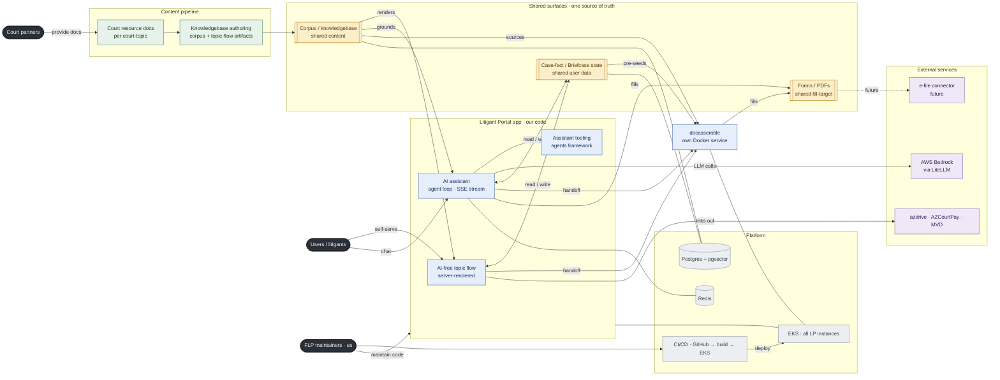

# Litigant Portal — system overview

The players and how they plug together, end to end. This is the **C4 Container level** (the whole system at a glance); each node earns a **Component-level** zoom-in later (its code stack, EKS services, sources).

Audience: FLP devs (new and current) and stakeholders. Read it left to right — court content flows in, becomes the shared knowledgebase, and the three consumers serve users; the platform sits underneath.

The one thing to see: **three shared surfaces** (gold) are the single source of truth every consumer reads and writes — the corpus/knowledgebase (shared content), the case-fact / Briefcase state (shared user data), and the forms (shared fill-target).

## Legend (also the dev "who owns what")

- **Ours (blue)** — code FLP writes and maintains: the Django app, the AI-free topic flow, the AI assistant + tooling, docassemble packaging.
- **Court content (green)** — provided by court partners: resource docs per court-topic, authored into the knowledgebase.
- **Shared surfaces (gold)** — the single source of truth all three consumers touch.
- **Platform (grey)** — infra FLP runs: EKS, Postgres/pgvector, Redis, CI/CD.
- **External (purple)** — third-party services we depend on but don't own.
- **Actors (dark)** — people/orgs: users, court partners, us.

## Node sub-lists

**AI-free topic flow** — server-rendered sections + light interview + deadlines; Django Cotton components; Alpine.js CSP build; progressive-enhancement floor (works without JS/AI).

**AI assistant** — agent loop with tool-calling; SSE streaming over `/api/agents/assistant/stream/`; grounded in the corpus; UPL/tone guardrail + adversarial check (John).

**Assistant tooling** — the agents framework (`litigant_portal/agents/`): tools, base classes, evaluation suite.

**docassemble** — separate Docker container; `/interview/*` routes; fills the forms; interviews are pre-seeded from case-fact state; PDF field mapping is bench-confirmed, not inferred.

**Corpus / knowledgebase** — per court-topic; facets: laws/authority, procedure/deadlines, decision logic, court config + contacts, forms + field-mapping, canned copy/FAQ, scenarios. Two trees today (`corpus/` DB tree, `content/` public tree; retirement open, #179). John's DB/AI tooling owns storage, vectorization, retrieval + the ingestion contract.

**Case-fact / Briefcase state** — the user's answers/case context, captured once and reused across flow, assistant, and forms (#177 Briefcase, #751 typed case-fact vocabulary).

**Forms / PDFs** — court forms; fill-target of both docassemble and the assistant; mostly external for AZ civil traffic (pay/register/contest), a real packet for ND name-change.

**Platform** — EKS hosts all LP instances (per-court); Postgres + pgvector holds corpus rows, vectors, and case state; Redis for cache/state; CI/CD deploys prod on merge-to-main, QA on manual dispatch only.

**External** — AWS Bedrock (via LiteLLM) powers the assistant; azdrive/AZCourtPay/MVD are court-partner-adjacent services users are routed to; e-file connector is future.

## Zoom-ins (Component level, TODO)

Each node above gets its own Component diagram: the Django app's internal layout (domain-below/surface-above), the assistant's agent loop, the corpus authoring pipeline + John's ingestion contract, the EKS service topology, and the CI/CD path. Filed separately as they're drawn.
